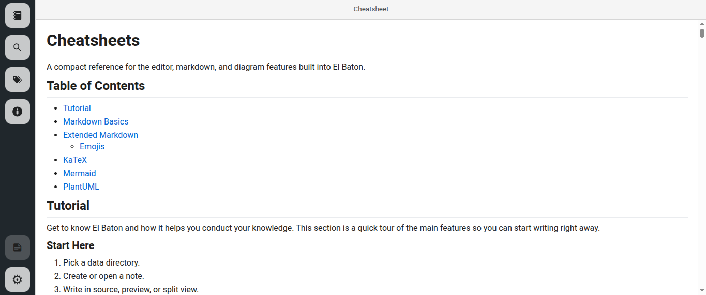
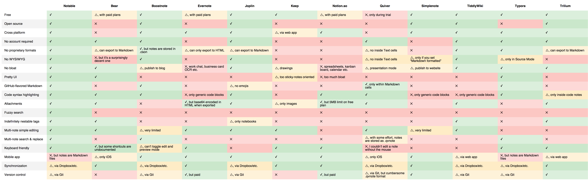
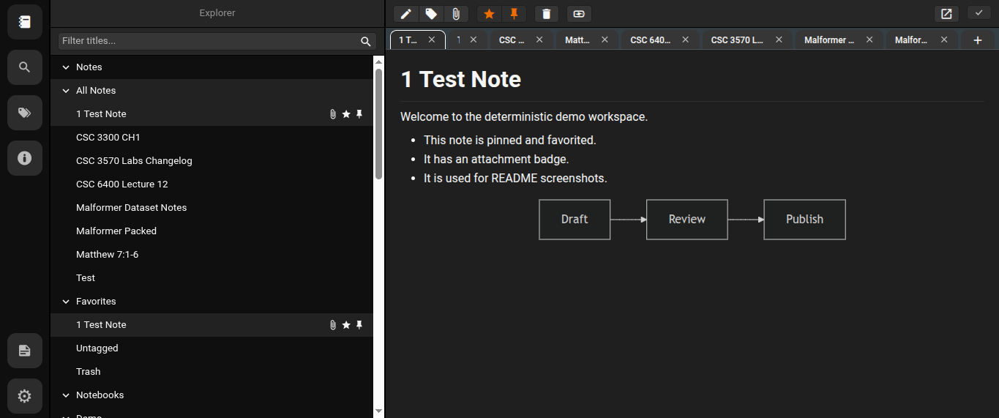
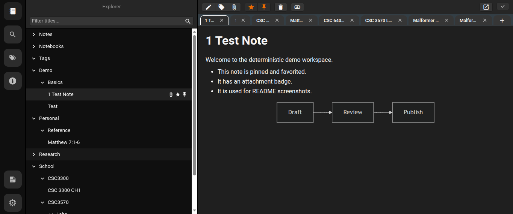
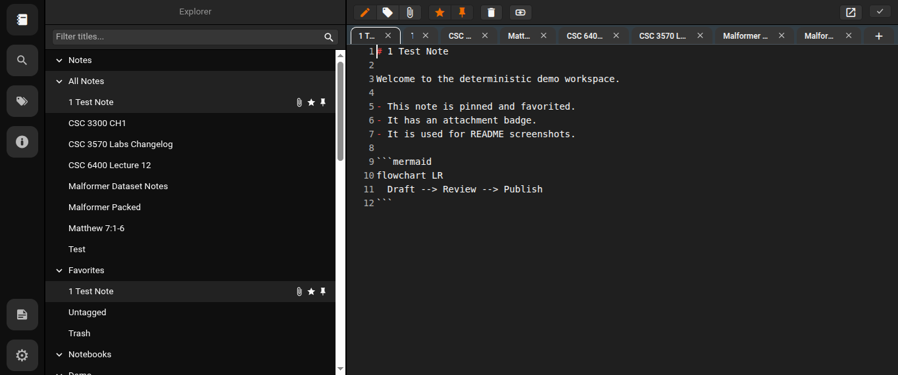
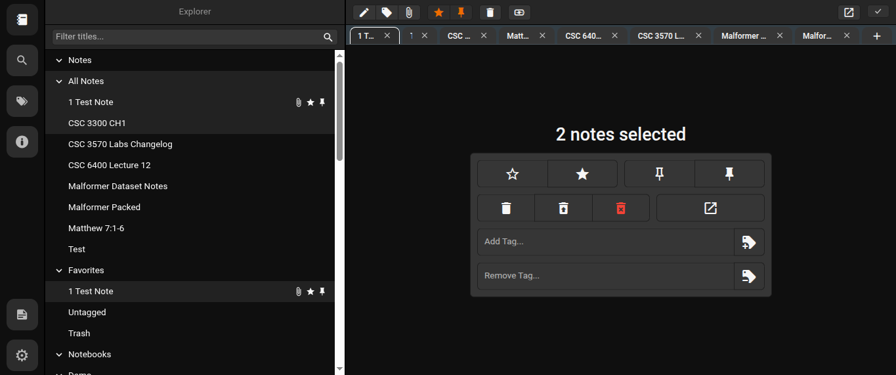
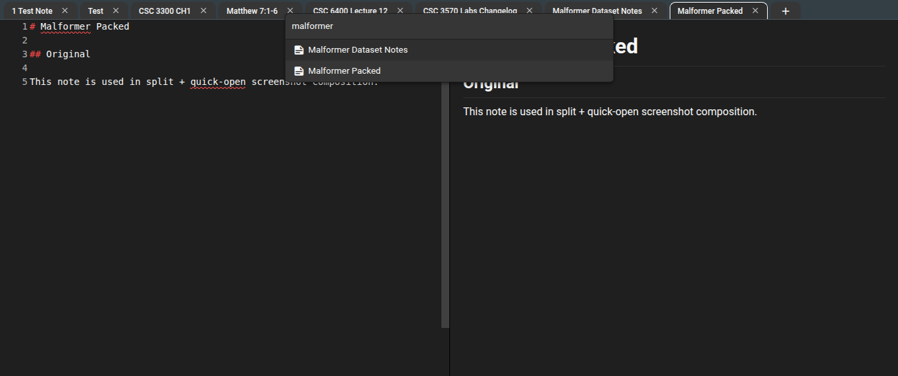

# El Baton ([DOWNLOAD](https://github.com/samhaswon/el-baton/releases))

<p align="center">
  
</p>

The markdown-based note-taking app for conducting your knowledge.

I couldn't find a note-taking app that ticked all the boxes I'm interested in: notes are written and rendered in GitHub-flavored Markdown, no WYSIWYG, no proprietary formats, I can run a search & replace across all notes, notes support attachments, the app isn't bloated, the app has a pretty interface, tags are indefinitely nestable and can import Evernote notes (because that's what I was using before).

So I built my own.

> **Native Qt port:** The C++/Qt 6 application is now the primary implementation
> and lives in [`src/`](src/). The retained Electron/TypeScript implementation
> lives under [`reference/`](reference/) as a behavioral reference while the
> port reaches parity. See the [native developer guide](docs/BUILDING.md) and
> [port status](docs/PORT_STATUS.md).

## Features

```
/path/to/your/data_directory
├─┬ attachments
│ ├── foo.ext
│ ├── bar.ext
│ └── …
└─┬ notes
  ├── foo.md
  ├── bar.md
  └── …
```

- **No proprietary formats**: El Baton is just a pretty front-end for a folder structured as shown above. Notes are plain Markdown files, their metadata is stored as Markdown front matter. Attachments are also plain files, if you attach a `picture.jpg` to a note everything about it will be preserved, and it will remain accessible like any other file.

- **Proper editor**: El Baton doesn't use a WYSIWYG editor: Markdown source is edited in QScintilla and rendered as GitHub-flavored Markdown in the preview. The retained reference application used Monaco and remains useful when checking detailed editing behavior.

- **Indefinitely nestable tags**: Pretty much all the other note-taking apps differentiate between notebooks, tags and templates. IMHO this unnecessarily complicates things. In El Baton you can have root tags (`foo`), indefinitely nestable tags (`foo/bar`, `foo/.../qux`) and it still supports notebooks and templates, they are just special tags with a different icon (`Notebooks/foo`, `Templates/foo/bar`).

On first launch with a new empty data directory, El Baton opens the built-in Cheatsheets panel so new users can quickly learn the workflow and core features.

## [Comparison](reference/resources/comparison/table.png?raw=true)

[](reference/resources/comparison/table.png?raw=true)

Part of this comparison is personal opinion: you may disagree on the UI front, things I consider bloat may be considered features by somebody else etc. but hopefully this comparison did a good job at illustrating the main differences.

## Demo

### Dark Theme



### Indefinitely Nestable Tags



### Editor



### Multi-Note Editor



### Split-Editor + Zen Mode + Quick Open



## Contributing

There are multiple ways to contribute to this project, read about them [here](https://github.com/samhaswon/el-baton/blob/master/.github/CONTRIBUTING.md).

## Related

- **[@notable/dumper](https://github.com/notable/dumper)**: Extract attachments, notes, and metadata from Evernote `.enex` files and other note export formats.
- **[Noty](https://github.com/fabiospampinato/noty)**: Autosaving sticky note with support for multiple notes without needing multiple windows.
- **[Markdown Todo](https://marketplace.visualstudio.com/items?itemName=fabiospampinato.vscode-markdown-todo)**: Manage todo lists inside markdown files with ease. Have the same todo-related shortcuts that El Baton provides, but in Visual Studio Code.
- **[Todo+](https://marketplace.visualstudio.com/items?itemName=fabiospampinato.vscode-todo-plus)**: Manage todo lists with ease. Powerful, easy to use and customizable.

## License

Base:
AGPLv3 © Fabio Spampinato

Fork code:
AGPLv3 © Samuel Howard
